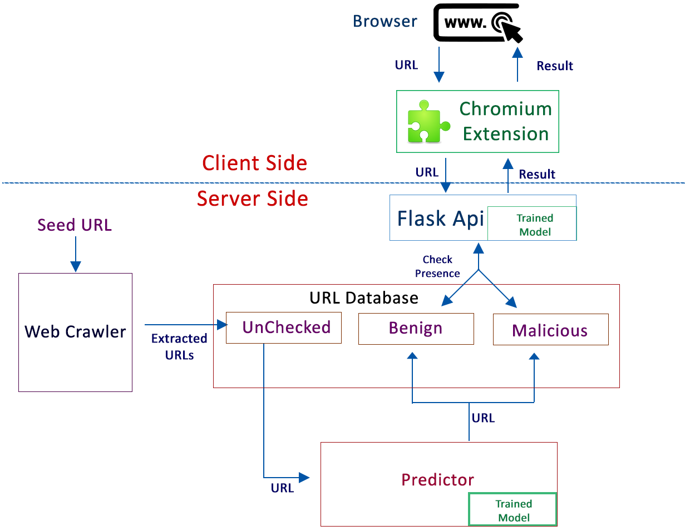

# Malicious URL Detection
## BTech Final Year Project
---
### **Aim of the Project**
1. Study and Design of Machine Learning Model for the prediction of the URL Behavior.
2. Design a Web Crawler of Initial List of URLs.
3. Design a chromium extension as an application of the above listed work.
---
### **Architecture**


#### Components:
1. Web Crawler
2. URL Database
3. Predictor
4. Flask API
5. Chrome Extension
---
### **Setup**

1. Create DataSet: [create_dataset.ipynb](Code/train_model/create_dataset.ipynb)
2. Train Model: [train.ipynb](Code/train_model/train.ipynb)
    1. Copy the Generated .pkl file [version1_Lexical.pkl](Code/train_model/version1_Lexical.pkl) to folder [flask_api](Code/falsk_api) and [background_predictor](Code/background_predictor).
    2. The top 10 features are analysed and are used to extract features in files [create_FVector_Improved.py](Code/server/background_predictor/create_FVector_Improved.py) and [create_FVector_Improved.py](Code/server/flask_api/create_FVector_Improved.py)
4. Download and Install [MongoDB](https://www.mongodb.com/try/download/community)
5. Install Chrome Extension - Malicious URL Detection
    1. Visit `chrome://extensions` in the chrome browser.
    2. Turn on Developer Mode.
    3. Click on `Load Unpacked` and Open the Folder [chrome_extension](Code/client/chrome_extension).


To run this Project<br>
- Database
```
mongo
```
- Web Crawler
```
# [Optional] For the initial List of URLs in the Database
python server/crawler/url_extractor.py <url>
```
- Background Predictor
```
python server/background_predictor/continuous_predictor.py
```
- Flask API
```
python server/flask_api/check_url.py
```
- Chrome Extension - Turn on extension `Malicious URL Detection` from Extensions menu.
